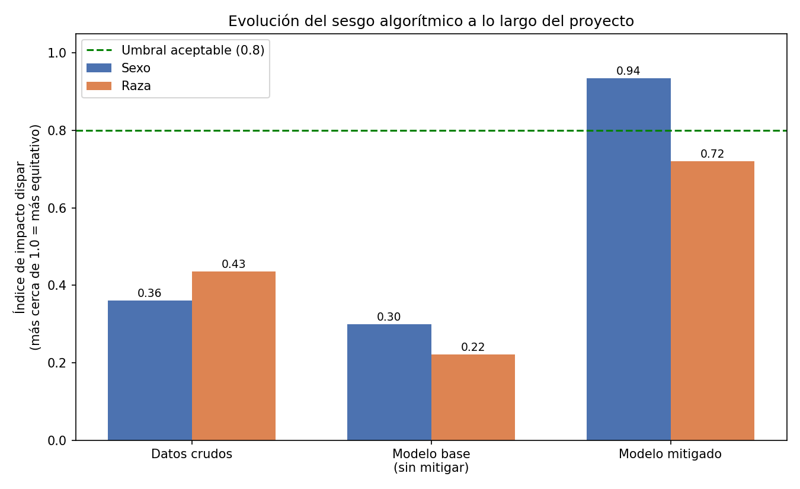

# Auditoría de sesgos en un modelo de predicción de ingresos

Proyecto de práctica para el curso **Experto en Arquitectura y Desarrollo de
Inteligencia Artificial** (Fundación Educativa Santísima Trinidad).

## Objetivo

Entrenar un modelo simple de Machine Learning que prediga si una persona
gana más o menos de 50.000 USD/año (dataset **Adult Income / UCI Census**),
y aplicar sobre él el proceso completo de identificación, mitigación y
monitoreo de sesgos algorítmicos visto en el curso, siguiendo criterios
alineados a **ISO/IEC 42001** (gestión responsable de sistemas de IA).

## Resultado principal



Un modelo entrenado sin controles de equidad **amplificó** el sesgo ya
presente en los datos (impacto dispar por sexo: 0.36 → 0.299). Aplicando
una técnica de mitigación por post-procesamiento (Fairlearn), ese sesgo
se corrigió casi por completo (0.299 → **0.935**) con un costo de
desempeño mínimo (solo 1.4 puntos de accuracy). Detalle completo en
[`docs/informe_mitigacion.md`](docs/informe_mitigacion.md).

## Por qué este dataset

Es un caso clásico y bien documentado para practicar *fairness* en ML:
tiene atributos sensibles (sexo, raza, edad) con desbalance conocido en la
variable objetivo, es chico (~48.000 filas) y corre rápido en cualquier
notebook.

## Estructura del repo

```
ai-bias-audit/
├── docs/
│   ├── informe_mitigacion.md      # informe completo estilo ISO 42001
│   └── grafico_impacto_dispar.png # gráfico resumen del proyecto
├── src/
│   ├── 01_load_and_explore.ipynb  # notebook con todos los pasos corridos
│   ├── 02_baseline_model.py       # modelo base + métricas de desempeño
│   ├── 03_fairness_audit.py       # mitigación de sesgo por sexo
│   ├── 04_monitor_agent.py        # agente de monitoreo continuo
│   └── 05_visualizacion.py        # gráfico comparativo final
├── requirements.txt
└── README.md
```

## Cómo correrlo

```bash
python -m venv venv
source venv/bin/activate    # en Windows: venv\Scripts\activate
pip install -r requirements.txt
pip install fairlearn
python src/01_load_and_explore.py
```

> Los scripts descargan el dataset desde OpenML la primera vez (necesitan
> conexión a internet) y lo cachean localmente.

## Estado del proyecto

- [x] Paso 1 — Carga de datos y primera detección de sesgo (`índice de
      impacto dispar`: 0.36 sexo / 0.435 raza)
- [x] Paso 2 — Modelo base (regresión logística, accuracy 84.6%) +
      confirmación de que el sesgo se amplifica en las predicciones
      (0.299 sexo / 0.221 raza)
- [x] Paso 3 — Mitigación de sesgo por sexo con Fairlearn
      (`ThresholdOptimizer`, demographic parity): impacto dispar 0.299 → 0.935
      con costo de solo 1.4 puntos de accuracy
- [x] Paso 4 — Mitigación de sesgo por raza: impacto dispar 0.221 → 0.72
      (mejora parcial, con hallazgo de sobrecorrección en grupos pequeños)
- [x] Paso 5 — Dashboard de evaluación final (gráfico comparativo)
- [x] Paso 6 — Agente de monitoreo continuo (4 lotes simulados, sin
      alertas, accuracy 81.8%-83.6%, impacto dispar 0.887-0.982)
- [x] Informe de mitigación estilo ISO 42001 (`docs/informe_mitigacion.md`)

## Próximos pasos posibles

- Mitigar el sesgo por raza con una técnica de pre-procesamiento (en
  lugar de post-procesamiento) para reducir el riesgo de sobrecorrección
  observado en grupos pequeños.
- Evolucionar el agente de monitoreo hacia un agente basado en LLM
  (razonamiento en lugar de reglas fijas), en línea con el Módulo 4 del
  curso.

## Referencias

- UCI Machine Learning Repository — Adult Data Set
- Fairlearn (Microsoft) — https://fairlearn.org
- ISO/IEC 42001:2023 — Sistemas de Gestión de Inteligencia Artificial
